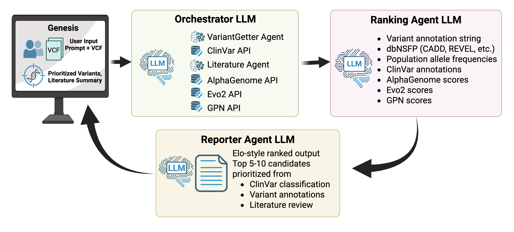

# KIDS25-Team22

# Genesis: Multi-Modal Agentic AI for Cancer Variant Effect Prioritization




## What this repository is

- An agent-based pipeline and web UI for variant prioritization. The code orchestrates multiple specialized agents to gather data, score variants, and produce reports.
- A Flask-based frontend (in `app/`) lets users upload VCFs or submit phenotype queries and streams run logs in real time.

This project is intended for research and experimentation. It relies on a number of scientific and machine-learning libraries and may require a dedicated conda environment.

## Quick highlights

- CLI entrypoint: `main.py` runs the orchestrator pipeline on a VCF and phenotype.
- Web UI: `app/app.py` provides a small Flask app (templates in `app/templates/`) to upload VCFs and view streaming logs.
- Core modules: `agents.py` (agent classes), `utils.py`, `llm_utils.py`, `Evo2score.py`, `prompts.py`, `config.py`.
- Example and sample data: `data/` and `uploads/` (uploads are created at runtime).

## Requirements

- Python 3.12 (code and pyc files indicate 3.12).
- A conda environment is recommended. The project contains a pinned `requirements.txt` with many heavy packages (Torch, Transformers, scientific stack).
- The following environment variables and API keys should be available as environment variables - `ALPGENOME_API_KEY`, `PCAI_EVO2_ENDPOINT`, `PCAI_EVO2_TOKEN`
- Ollama should be serving and have appropriate models available as mentioned in the `config.py`


## Suggested setup

1. Create and activate a conda environment (example):

```bash
conda create -n kids25 python=3.12 -y
conda activate kids25
```

2. Install Python dependencies:

```bash
pip install -r requirements.txt
```


## Run the CLI pipeline

Process a VCF with a phenotype:

```bash
python main.py --vcf_file ./data/clinvar.hg19.chr17.test.vcf --phenotype "breast cancer"
```

`main.py` exposes additional arguments (e.g., `--conda_env`) — run `python main.py -h` for details.

## Run the web app

Start the Flask server (development mode):

```bash
python app/app.py
```

Open http://localhost:5001 in your browser. The UI supports uploading `.vcf` / `.vcf.gz` files and submitting phenotype text. Logs stream to the UI while the pipeline runs.

## Project structure (key files)

- `main.py` — CLI entrypoint and orchestrator setup
- `agents.py` — agent implementations and coordination
- `app/` — Flask application, templates, static assets
- `data/` — example VCFs, reference FASTA and example outputs
- `uploads/` — runtime uploads (created automatically)
- `requirements.txt` — pinned Python packages
- helper modules: `utils.py`, `llm_utils.py`, `prompts.py`, `config.py`
- `LICENSE` — project license

## Notes, caveats, and suggestions

- The codebase references local model servers and services (comments in `main.py` mention Ollama and model endpoints). Ensure any required external services or credentials are available before running those parts.
- Several large pickled artifacts live in the repo root (e.g., `variant_*_object.pkl`). These are data artifacts used by agents.
- This README is a concise starting guide. I can expand it with development notes, testing instructions, architecture diagrams, or example outputs on request.

## License

See the `LICENSE` file in the repository root.
